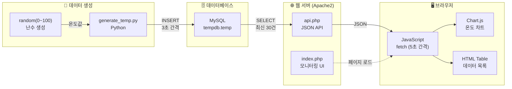
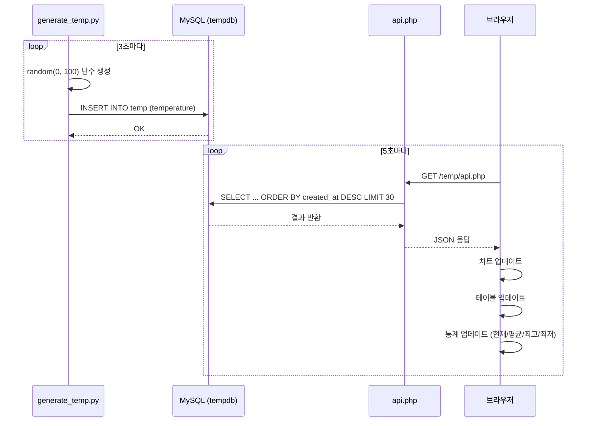
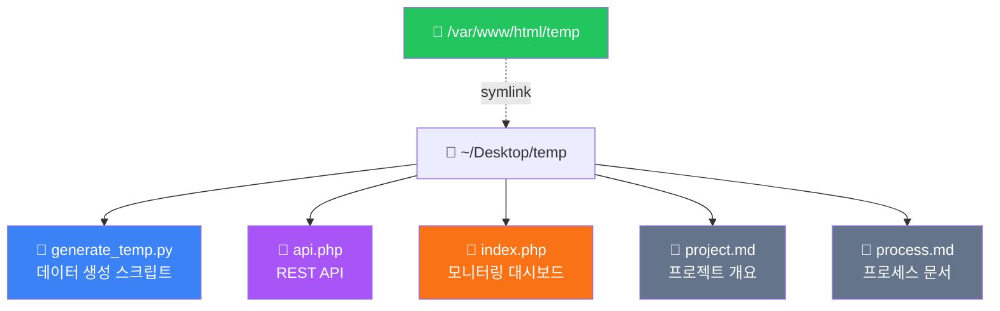
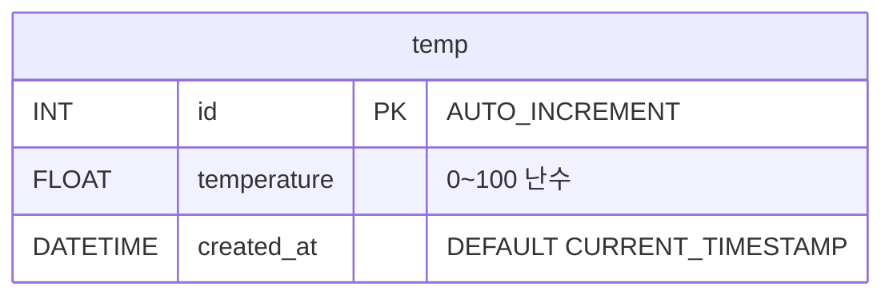

# 온도 센서 모니터링 프로젝트 프로세스

## 프로젝트 개요

0~100 사이의 가상 온도 데이터를 생성하여 MySQL에 저장하고, PHP 기반 동적 웹 페이지에서 실시간 모니터링하는 시스템

## 시스템 구성

| 구성 요소 | 기술 | 설명 |
|-----------|------|------|
| 데이터 생성기 | Python | 3초 간격으로 난수 온도 생성 |
| 데이터베이스 | MySQL (tempdb) | temp 테이블에 온도 데이터 저장 |
| API 서버 | PHP (api.php) | DB에서 최신 30건 JSON 반환 |
| 모니터링 UI | HTML/JS (index.php) | 차트 + 테이블 실시간 표시 |
| 웹 서버 | Apache2 | PHP 실행 및 정적 파일 서빙 |

## 데이터 흐름

1. `generate_temp.py`가 0~100 사이의 난수를 생성
2. 생성된 온도 데이터를 MySQL `tempdb.temp` 테이블에 INSERT
3. 브라우저가 5초마다 `api.php`에 AJAX 요청
4. `api.php`가 MySQL에서 최신 30건을 조회하여 JSON 반환
5. `index.php`의 JavaScript가 JSON 데이터를 파싱
6. Chart.js 차트 및 HTML 테이블을 동적으로 업데이트

## 전체 시스템 블록도

## 상세 데이터 처리 흐름

## 파일 구조

## DB 스키마

